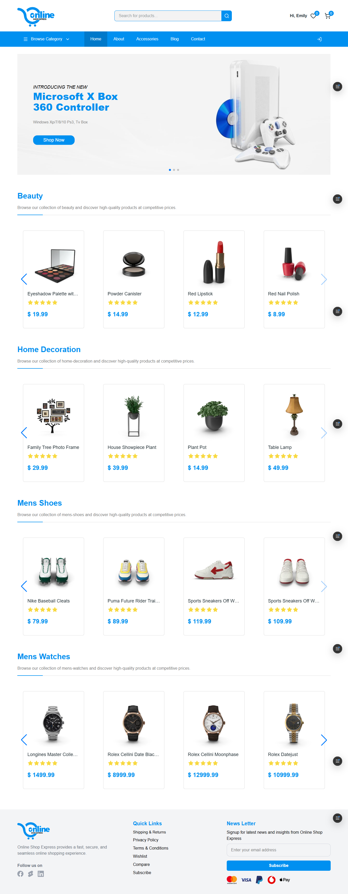
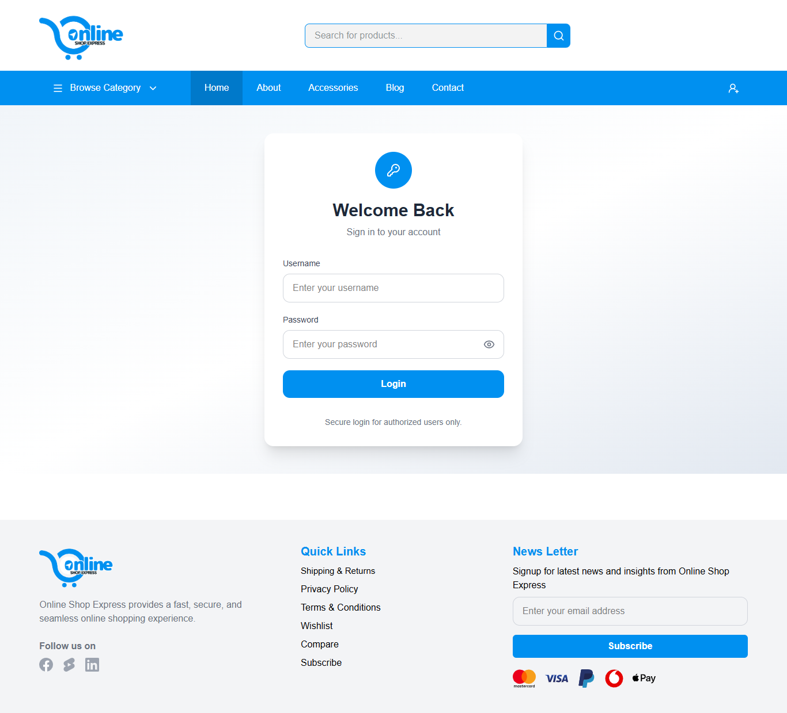
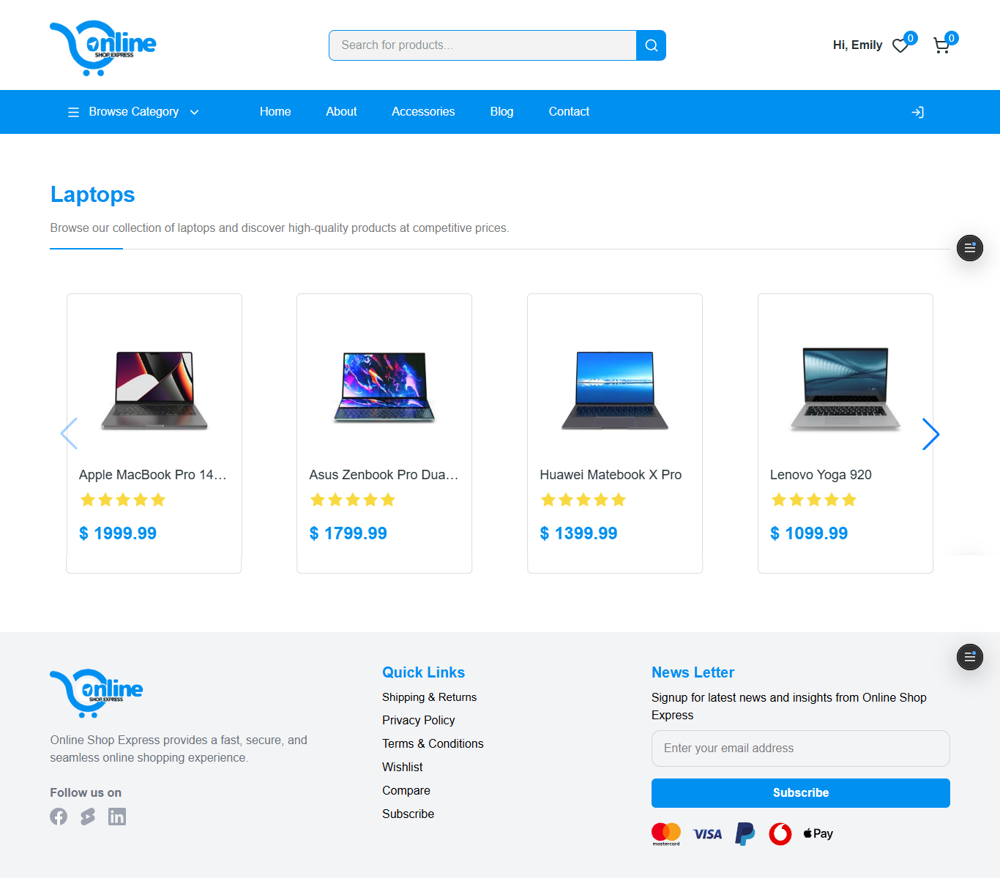
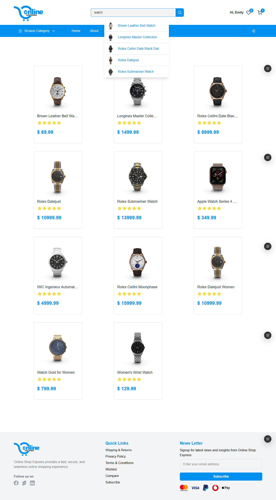
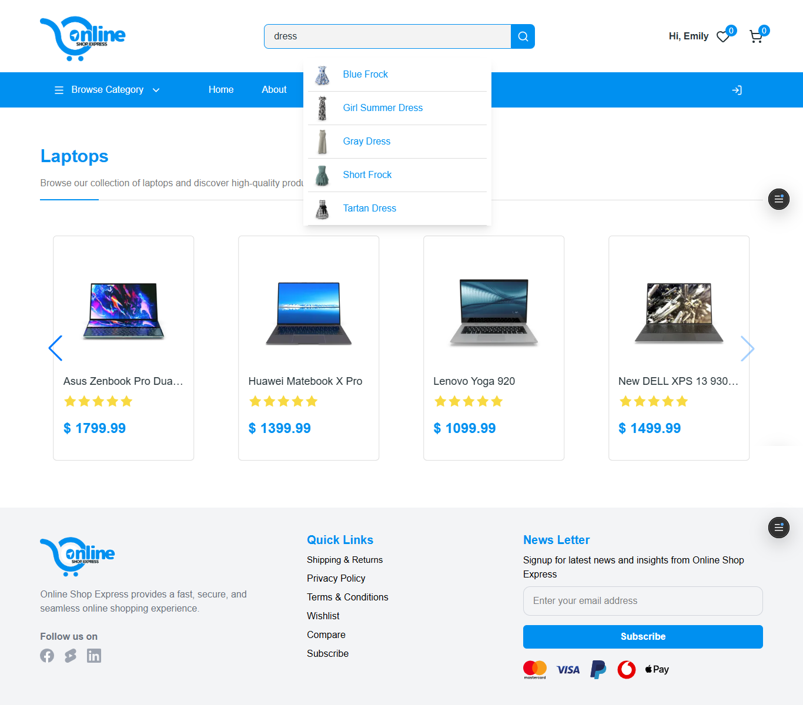
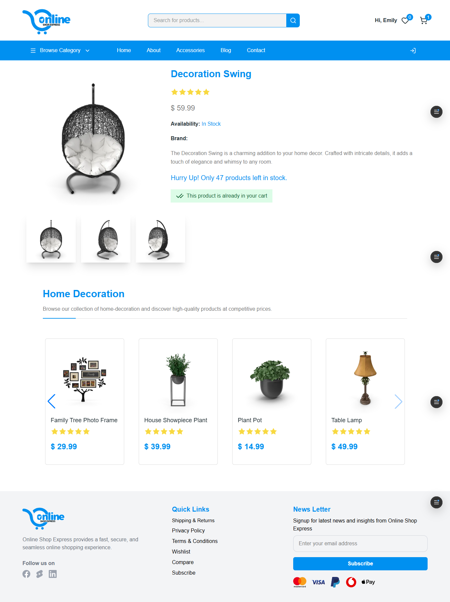
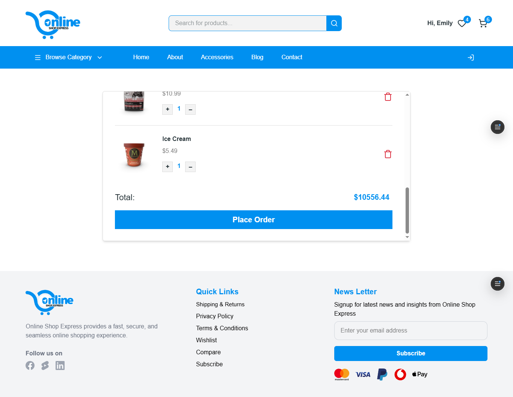
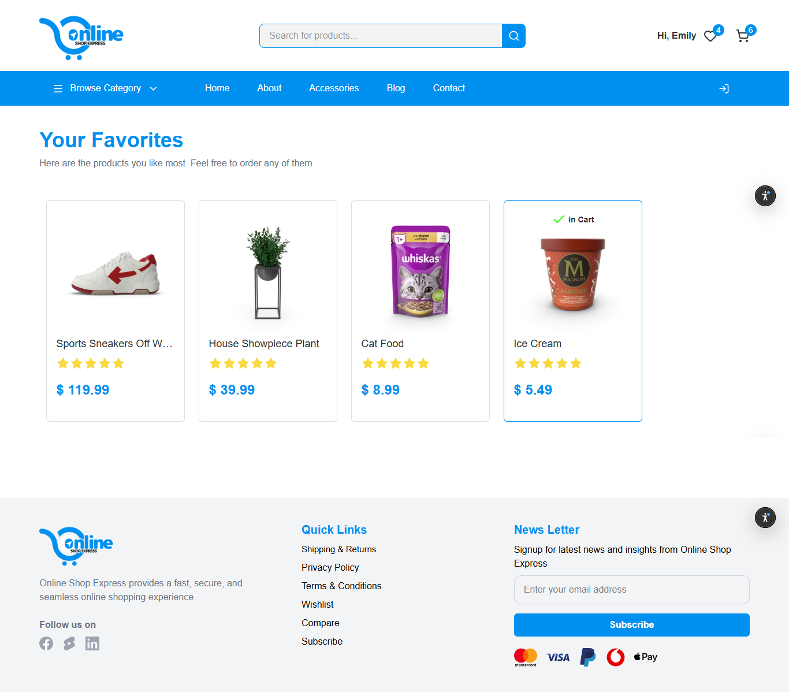

<div align="center">

# 🛍️ Online Shop Express



A modern, responsive E-Commerce web application built with **React**, **Redux Toolkit**, and **Vite**.

A modern E-Commerce application focused on building scalable frontend architecture using React, Redux Toolkit, reusable components, asynchronous API integration, and responsive UI design.
<br>


### 🔗 [Live Demo](https://online-shop-express.vercel.app) • [Repository](https://github.com/mahmoudMokhtar-94/online-shop-express)

</div>

---

# 📖 Table of Contents

- [Project Overview](#-project-overview)
- [Project Goal](#-project-goal)
- [Features](#-features)
- [Tech Stack](#-tech-stack)
- [Project Structure](#-project-structure)
- [Architecture](#-architecture)
- [Screenshots](#-screenshots)
- [Installation](#-installation)
- [Technical Highlights](#-technical-highlights)
- [Challenges](#-challenges)
- [What I Learned](#-what-i-learned)
- [Future Improvements](#-future-improvements)
- [Author](#-author)

---

# 📌 Project Overview

Online Shop Express is a modern E-Commerce application built to practice real-world frontend development using React and Redux Toolkit.

The application demonstrates how to build a scalable shopping experience featuring authentication, product browsing, category filtering, search with live suggestions, shopping cart management, favorites, persistent user sessions, responsive layouts, and proper handling of loading and error states.

---

## 🎯 Project Goal

The goal of this project was to gain practical experience building a modern e-commerce application using React and Redux Toolkit while applying best practices in state management, API integration, component reusability, and responsive design.

# ✨ Features

## 🔐 Authentication

- Login using DummyJSON Authentication API
- Persistent Login using LocalStorage
- Logout functionality
- Automatic redirect after successful login
- Friendly UI for invalid credentials

---

## 🛒 Shopping

- Browse all products
- Browse products by category
- Product Details page
- Multiple product images
- Product availability
- Stock quantity
- Brand information
- Related products from the same category
- Add products to Cart
- Update Cart quantity
- Remove products from Cart
- Add products to Favorites
- Remove products from Favorites

---

## 🔍 Search

- Search products
- Real-time search suggestions
- No Results UI

---

## 🎨 User Experience

- Fully responsive layout
- Skeleton Loading
- Toast Notifications
- Empty Cart UI
- Empty Favorites UI
- Network Error UI
- Loading States
- Error States

---

# 🛠️ Tech Stack

| Category         | Technology       |
| ---------------- | ---------------- |
| Frontend         | React + Vite     |
| State Management | Redux Toolkit    |
| Routing          | React Router DOM |
| Styling          | Tailwind CSS     |
| HTTP Client      | Axios            |
| Slider           | Swiper.js        |
| Icons            | Lucide React     |
| API              | DummyJSON API    |
| Persistence      | LocalStorage     |

---

# 📂 Project Structure

```text
src
│
├── api
├── components
├── contexts
├── icons
├── images
├── pages
├── skeletons
├── slices
└── states
```

---

# 🏗️ Architecture

```text
User
   │
React Components
   │
Redux Toolkit
   │
createAsyncThunk
   │
Axios Instance
   │
DummyJSON API
```

---

# 📸 Screenshots

## 🏠 Home


---

## 🔑 Login



---

## 📂 Browse by Category



---

## 🔍 Search Results



---

## 💡 Search Suggestions



---

## 📦 Product Details



---

## 🛒 Shopping Cart



---

## ❤️ Favorites



```text
screenshots/
├── Home.png
├── Login.png
├── ProductDetails.png
├── Search.png
├── Cart.png
└── Favorites.png
```

---

# 🚀 Installation

Clone the repository

```bash
git clone https://github.com/mahmoudMokhtar-94/online-shop-express.git
```

Navigate to the project

```bash
cd online-shop-express
```

Install dependencies

```bash
npm install
```

Run the development server

```bash
npm run dev
```

---

# ⚙️ Technical Highlights

- Modern React architecture.
- Global state management using Redux Toolkit.
- Asynchronous requests using createAsyncThunk.
- Axios instance with centralized baseURL.
- Protected Routes.
- Persistent Authentication using LocalStorage.
- Persistent Cart and Favorites.
- Real-time Search Suggestions.
- Skeleton Loading for improved UX.
- Reusable Components.
- Custom Hooks.
- Graceful Loading and Error handling.
- Fully Responsive UI built with Tailwind CSS.

---

# 💡 Challenges

One of the most interesting challenges while building this project was implementing **real-time search suggestions**.

The search feature was designed using separate states:

- One state for tracking the user's input.
- Another state for managing search suggestions.

This separation made it easier to update suggestions dynamically while keeping the interface responsive and avoiding unnecessary rendering issues.

---

# 📚 What I Learned

Through this project I gained practical experience with:

- React Fundamentals
- Component Reusability
- Redux Toolkit
- Async State Management
- createAsyncThunk
- React Router
- API Integration
- Axios
- LocalStorage Persistence
- Skeleton Loading
- Error Handling
- Responsive Design
- Tailwind CSS
- Building scalable frontend applications

---

# 🔮 Future Improvements

- User Registration
- JWT Authentication
- Backend Integration
- User Profile
- Checkout Process
- Payment Gateway
- Order History
- Product Reviews
- Pagination
- Admin Dashboard
- Dark Mode

---

# 👨‍💻 Author

**Mahmoud Mokhtar**

Frontend Developer (React)

---

<div align="center">

### ⭐ If you enjoyed exploring this project, feel free to give it a star on GitHub!

</div>
